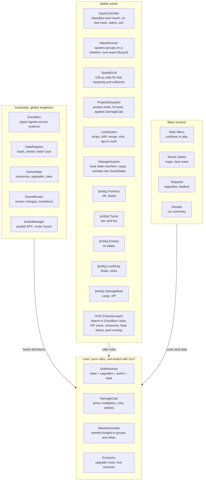

# Iron Harbor — Game Design & Technical Architecture

Oct 4, 2026 · @Matej

## 1. Overview

Iron Harbor (working title) is a portrait-mode Android defense game: a naval fortress sits in the center of the screen, enemies arrive from the edges, and the player aims the fortress weapons with a finger. Destroyed enemies drop money and materials that float on the water and sink after a few seconds, so the player must actively send a salvage boat to collect them. Everything collected funds permanent upgrades of the base and its weapons.

**Core loop (one run):**

1. Start a run in a chosen sector. Waves of enemies approach from the screen edges.
2. Drag a finger to aim the selected turret; it fires while the finger is down. Other turrets fire on their own only if the player has upgraded Auto-Targeting.
3. Destroyed enemies drop loot into the water. Tap loot to mark it; the salvage boat leaves the dock, collects it and brings it back. Unmarked loot sinks.
4. Every 5 waves the player picks 1 of 3 temporary perks (run-only boosts).
5. Every 10 waves a boss arrives. The run ends when base HP reaches 0. Collected resources are kept.
6. Between runs, spend resources in the Shipyard on permanent upgrades, new weapons and new turret slots. Reaching wave thresholds unlocks harder sectors with better loot multipliers.

**Design pillars:** the finger is the main weapon (skill matters, but upgrades can partly automate it); greed vs. safety (sending the boat out exposes it); visible, steady power growth against exponentially harder waves.

**Scope of v1:** single-player, offline, no ads, no in-app purchases, no accounts. 7 weapons, 12 enemy types, 3 bosses, 4 sectors, Slovak and English UI. Monetization and cloud saves are explicitly out of scope; the architecture should not block adding them later.

## 2. Tech stack and build pipeline

Use **Godot 4 (latest stable 4.x) with GDScript**, written code-first so Claude Code can build and modify everything as plain text. Godot gives a real 2D engine (particles, tweens, collision, audio, multi-touch) with a small APK, a free license, and a headless command-line Android export.

| Option | Verdict | Reason |
|---|---|---|
| Godot 4 + GDScript | Chosen | Text-based scenes and scripts, headless export, strong 2D, no license fees |
| Flutter + Flame | Fallback | Pure code and fine for 2D, but weaker particles/audio tooling and more manual game-loop work |
| Unity | Rejected | Heavy editor dependency, binary-ish assets, poor fit for an AI agent working from the terminal |
| Kotlin + libGDX | Rejected | Workable, but slower iteration and more boilerplate |

**Code-first rules for Claude Code:**

- Keep `.tscn` scenes minimal (root node + script). Build child nodes in `_ready()` from code or from data, so changes never require the visual editor.
- Gameplay rules live in pure GDScript classes (`RefCounted`) with no node dependencies, so they can be unit-tested headlessly.
- Static typing everywhere (`var hp: float`), and `class_name` for every reusable script.
- All tunable numbers live in JSON under `res://data/`, never hard-coded.

**Toolchain to install on the dev machine:** Godot 4.x (standard build, not .NET), Godot Android export templates, OpenJDK 17, Android SDK (command-line tools, platform-tools, build-tools, one recent platform), and a debug keystore. A release keystore is created once before publishing and must never be committed.

**Build commands (headless):**

```sh
godot --headless --import                                   # first run, imports assets
godot --headless -s addons/gut/gut_cmdln.gd -gexit          # run unit tests
godot --headless --export-debug "Android" build/iron-harbor-debug.apk
adb install -r build/iron-harbor-debug.apk                  # install on a USB-connected phone
```

`export_presets.cfg` is committed (without passwords); keystore paths and passwords come from environment variables. Target: arm64-v8a, minimum Android 8.0 (API 26), renderer Mobile (fallback Compatibility for older GPUs).

**Repository layout:**

```
iron-harbor/
  CLAUDE.md              # rules for Claude Code (summary of this document)
  docs/GAME_DESIGN.md    # this document
  project.godot
  export_presets.cfg
  data/                  # JSON configs: weapons, enemies, waves, upgrades, perks, sectors, loot
  autoload/              # global singletons
  core/                  # pure logic: formulas, damage, economy, wave budget (unit-tested)
  battle/                # battle scene, systems, entities
  meta/                  # shipyard, sector select, results
  ui/                    # shared UI widgets, theme
  assets/                # sprites, audio, fonts
  locale/                # translations.csv (sk, en)
  tests/                 # GUT tests
  tools/                 # balance simulator, debug menu
```

## 3. Controls

One finger aims and fires the selected turret; a tap on floating loot marks it for salvage; a second finger can aim a second turret once that upgrade is owned. Every touch is classified on touch-down, so aiming and collecting never conflict.

**Screen layout (portrait, design resolution 1080 × 2400, stretch mode `canvas_items`, aspect `expand`):** top bar (base HP, wave, resources), the ocean playfield with the fortress in the exact center, bottom bar with one button per turret slot (icon, ammo/heat, cooldown) plus a pause button.

**Gesture rules, evaluated in this order on touch-down:**

1. Touch lands on a UI control → UI handles it, no gameplay.
2. Touch lands within 48 dp of a floating loot item → mark that loot (and any other loot within 48 dp) for salvage. Haptic tick.
3. Touch lands on a turret on the fortress or its bottom-bar button → select that turret. No firing on this touch.
4. Anything else → aim touch. The selected turret rotates toward the finger at its turn speed (not instantly) and fires while the finger is down and the turret is within 4° of the target angle.

**Aim feel:** the turret aims at the finger position projected from the fortress center; a thin dotted aim line shows the trajectory, and its length equals the weapon range. Turn speed is a weapon stat (machine gun fast, cannon slow), which makes weapons feel different. Optional setting "aim assist" snaps up to 6° toward the nearest valid enemy.

**Multi-touch:** the first aim touch controls the selected turret. A second simultaneous aim touch controls the turret selected before it, only if the Dual Command upgrade is owned. Track touches by `InputEventScreenTouch.index`.

**Unselected turrets:** idle by default. The base upgrade Auto-Targeting (levels 0–10) lets them fire automatically at a reduced rate: 20 % of manual fire rate at level 1, up to 70 % at level 10. Manual control always stays stronger, rewarding active play.

**Other input:** two-finger tap or the back button pauses; long-press on a turret button shows its stats; the salvage boat can also be recalled by tapping the dock.

## 4. Weapons

Seven weapons, each strong against a different enemy domain or armor type, so no single weapon can carry a run. The player starts with 2 slots holding the Machine Gun and the Naval Cannon; the rest are unlocked in the Shipyard.

**Base stats at level 1** (distances in design pixels at 1080 px width; the fortress radius is 140 px):

| Weapon | Hits | Damage type | Damage | Shots/s | Range (px) | Turn (°/s) | Special | Unlock |
|---|---|---|---|---|---|---|---|---|
| Machine Gun | Surface, Air | Kinetic | 6 | 8 | 550 | 360 | 4° spread | Start |
| Naval Cannon | Surface | Explosive | 45 | 0.8 | 800 | 90 | 60 px splash | Start |
| Missile Launcher | Surface, Air | Explosive | 30 | 0.6 (salvo of 2) | 900 | 180 | Homing, retargets if target dies | Best wave 8 |
| Torpedo Tube | Surface, Submerged | Explosive | 80 | 0.35 | 1000 | 60 | Runs along water, pierces 2 | Best wave 15 |
| Depth Charge Mortar | Submerged, Surface | Explosive | 60 | 0.5 | 450 | 120 | Lobbed to aim point, 90 px splash | Best wave 20 |
| Laser | Surface, Air | Energy | 40 per second | Continuous | 700 | 200 | Heat: overheats after 5 s, 3 s cooldown | Best wave 30 |
| Railgun | Surface, Air, Submerged (surfaced only) | Energy | 220 | 0.25 | 1400 | 45 | 1 s charge, pierces everything in line | Best wave 45 |

Unlocking a weapon also costs resources (see section 8). A weapon can be mounted in any free slot; each weapon type can be mounted at most twice.

**Domains:** every enemy is Surface, Submerged or Air. A projectile only collides with enemies in a domain its weapon can hit. Submerged enemies are invisible except for a ripple outline until they surface.

**Damage formula:**

```
D = D_base · M_level · M_tier · M_perks · M_armor(type, armor) · (crit ? 2 : 1)
```

Base crit chance is 5 %. Shields are a separate HP pool on top of hull HP; shields regenerate 10 % per second after 3 s without damage.

**Armor multipliers (damage type vs. enemy armor):**

| Damage type | Light | Armored | Shield |
|---|---|---|---|
| Kinetic | 1.0 | 0.5 | 0.75 |
| Explosive | 1.0 | 1.25 | 0.75 |
| Energy | 0.9 | 1.0 | 1.5 |

**Per-weapon upgrade tracks** (permanent, bought in the Shipyard): Damage (+12 % per level, compounding), Fire Rate (+4 % per level, cap ×2.5), Range (+3 % per level, cap ×1.5), Turn Speed (+6 % per level, cap ×2), and one Special track with 5 levels (e.g. cannon splash radius, missile salvo size, torpedo pierce count, laser heat capacity). Every 10 Damage levels the weapon needs a Tier-up that costs Electronics and gives an extra ×1.25 damage, which is the main Electronics sink.

**Projectiles:** all projectiles are pooled. Bullets and shells travel in straight lines with a lifetime equal to range ÷ speed. Missiles steer with a capped turn rate. Torpedoes are Surface-layer projectiles that also hit Submerged targets. The laser is a raycast, not a projectile.

## 5. Enemies

Twelve regular enemy types unlock gradually from wave 1 to wave 38, so every few waves the player meets a new problem that needs a different weapon. HP values below are at wave multiplier 1.0; section 6 scales them.

| Enemy | Domain | Armor | HP | Speed (px/s) | Behavior | Budget cost | First wave |
|---|---|---|---|---|---|---|---|
| Raider Skiff | Surface | Light | 20 | 120 | Rams the base (5 dmg), dies on contact | 1 | 1 |
| Patrol Boat | Surface | Light | 60 | 70 | Stops at 500 px, gun 3 dmg every 1.5 s | 3 | 3 |
| Attack Drone | Air | Light | 12 | 200 | Kamikaze 4 dmg, spawns in groups of 5 | 2 per group | 5 |
| Torpedo Boat | Surface | Light | 80 | 90 | Stops at 850 px, fires a torpedo (15 dmg, 10 HP, can be shot down) every 4 s | 5 | 8 |
| Salvage Hunter | Surface | Light | 90 | 170 | Hunts the salvage boat first, then the base | 6 | 10 |
| Armored Gunboat | Surface | Armored | 200 | 50 | Stops at 600 px, cannon 8 dmg every 2 s | 8 | 12 |
| Submarine | Submerged | Armored | 150 | 60 | Surfaces at 700 px for 3 s to fire a torpedo, then dives | 9 | 15 |
| Bomber | Air | Light | 120 | 110 | Flies straight across the screen over the base, drops bombs (20 dmg), exits | 8 | 18 |
| Minelayer | Surface | Armored | 180 | 60 | Circles at 650 px, drops drifting mines (25 dmg, 15 HP) every 3 s | 10 | 22 |
| Shield Frigate | Surface | Shield | 250 + 200 shield | 45 | Gives +50 shield to allies within 200 px | 15 | 28 |
| Landing Craft | Surface | Armored | 300 | 55 | On contact: 40 dmg and disables a random turret for 8 s | 12 | 32 |
| Missile Corvette | Surface | Shield | 220 + 120 shield | 80 | Stops at 1000 px, fires missiles (12 dmg; missiles are Air targets) every 3 s | 14 | 38 |

Enemy attacks cannot be dodged, but some of them can be shot down (torpedoes, mines, missiles). This gives the machine gun a defensive role late in the game.

**Movement and AI:** each enemy runs a small state machine: `SPAWN → APPROACH → ENGAGE or RAM → EXIT/DEAD`. Approach steers toward the fortress with a slight sine weave (amplitude 20–40 px) and separation steering so groups do not overlap. Ranged enemies stop at their engage distance and orbit slowly. Any enemy touching the fortress radius deals its contact damage and is destroyed.

**Elite modifiers:** from wave 15 any regular enemy can roll elite, with chance 2 % + 0.5 % per wave above 15, capped at 35 %. An elite gets one random modifier: Armored (armor class one step up), Fast (+40 % speed), Regenerating (2 % HP per second), Shielded (+50 % HP as shield) or Splitting (spawns 2 Raider Skiffs on death). Elites glow, drop 3× loot and always drop Electronics.

**Bosses (every 10th wave, rotating; boss waves have no other spawns for the first 15 s):**

| Boss | Waves | Domain / armor | Base HP | Mechanic |
|---|---|---|---|---|
| Dreadnought | 10, 40, 70… | Surface, Armored | 3000 | Three destroyable gun hardpoints (300 HP each); each destroyed hardpoint removes one of its attacks |
| Carrier | 20, 50, 80… | Surface, Armored + 800 shield | 4000 | Launches a group of 5 Attack Drones every 6 s from its deck |
| Leviathan Sub | 30, 60, 90… | Submerged, Armored | 3500 | Three phases; surfaces for 5 s per phase, otherwise only torpedoes and depth charges can hurt it; lays mines when below 50 % HP |

Boss HP is multiplied by the same wave HP multiplier as regular enemies. Killing a boss drops a guaranteed Core (rare currency, section 8).

## 6. Waves and difficulty

Each wave gets a point budget that grows faster than linearly, and enemy HP grows exponentially (×1.085 per wave) while loot value grows only ×1.06 per wave. That gap is intentional: the player can never out-earn the curve within one run and must return to the Shipyard to push further.

**Scaling formulas (w = wave number, starting at 1):**

```
B(w) = 8 + 5w + 0.12w²        H(w) = 1.085^(w−1)        A(w) = 1 + 0.04·(w−1)
S(w) = min(1 + 0.004·(w−1), 1.3)                         L(w) = 1.06^(w−1)
```

B is the spawn budget, H the enemy HP multiplier, A the enemy damage multiplier, S the enemy speed multiplier and L the loot value multiplier. All constants live in `data/waves.json` so balancing never touches code. Sector multipliers (section 8) are applied on top.

**Wave generation (deterministic, seeded by run seed + wave number):**

1. Collect enemy types whose first wave ≤ w. A newly unlocked type is "featured" for 3 waves with weight ×3.
2. Spend the budget B(w): repeatedly pick a type by weight, pick a group size (1–5, cheaper types come in bigger groups), subtract cost × group size, stop when nothing fits.
3. Assign each group a formation (line, V, cluster, wide spread) and a spawn edge. Waves 1–19: left/right edges 80 %, top/bottom 20 %. From wave 20: all edges equally, and every 5th wave is a pincer (two groups from opposite edges at the same time).
4. Lay the groups on a timeline of 20–30 s; gaps between groups shrink from 4 s to 1.5 s across the wave, so pressure peaks at the end.
5. Roll elite modifiers per enemy (section 5).

**Wave lifecycle:** `PREPARE (3 s countdown) → ACTIVE (spawning) → CLEANUP (until no enemies left) → BREAK (6 s, loot still floats, salvage boat keeps working) → next wave`. After waves 5, 10, 15… the break pauses for the perk choice. Boss waves replace step 2 with the boss plus escorts worth 30 % of the budget, starting 15 s after the boss appears.

**Fail state:** base HP reaches 0 → slow-motion explosion → results screen. All resources already brought back to the dock are kept; loot still floating or in the boat's cargo is lost.

## 7. Loot and salvage

Loot is only worth something once the salvage boat has physically brought it back to the dock. Floating loot sinks after 10 s, so the player constantly trades attention and risk (sending the boat into enemy waters) for income.

**Resources:**

| Resource | Source | Main use |
|---|---|---|
| Credits | Every enemy | All upgrades, weapon levels |
| Steel | 25 % of Light enemies, 60 % of Armored | Base hull, armor, new slots, mid-level weapon upgrades |
| Electronics | 4 % base, 10 % from Air enemies, 100 % from elites | Weapon tier-ups, Auto-Targeting, Radar, boat AI |
| Cores | Bosses only (1 per boss, 3 in sector 3+) | Big unlocks: turret slots 5–8, Dual Command, second and third boat |

Drop amount = base amount from the enemy's loot table × L(w) × sector loot multiplier × perk multipliers, rounded up.

**Floating loot:** spawns at the death point with a small random scatter (±30 px), drifts with the sector current at 8–15 px/s, blinks during its last 3 s and then sinks with a ripple. Loot items of the same type within 30 px merge into one crate to keep the screen readable. Float time is upgradeable (Flotation Foam: +1 s per level, up to 20 s).

**Salvage boat:**

- Starts docked at the fortress dock (bottom side of the fortress). Base stats: speed 160 px/s, cargo 8 items, pickup radius 30 px, 50 HP, respawn 12 s after destruction.
- State machine: `DOCKED → OUTBOUND → COLLECTING → RETURNING → UNLOADING (0.8 s) → DOCKED`. It visits marked loot in nearest-neighbor order and re-plans whenever new loot is marked. It returns when cargo is full, when no marked loot remains, or when recalled by tapping the dock.
- While moving, it grabs any loot within its pickup radius, marked or not.
- If destroyed, its cargo spills back into the water as new loot with only 4 s float time, giving one last chance to recover it.
- Threats: Salvage Hunters target it first; bomb and mine explosions damage it; everything else ignores it.

**Salvage upgrades (permanent):** Engine (speed), Hold (cargo), Magnet (pickup radius up to 120 px), Hull (boat HP), Auto-Salvage (levels 1–5: the boat collects unmarked loot within a radius around the fortress that grows to the full screen at level 5; marked loot always has priority), Fleet (second boat for 1 Core, third boat for 3 Cores), Salvage Drone (unlocks at best wave 35: a fast flying collector with 3 cargo slots that can only be shot by Air-attacking enemies).

## 8. Progression and economy

Progression has two layers: permanent upgrades bought in the Shipyard between runs (the main power curve), and temporary perks picked during a run (variety). Target pacing: the first run reaches wave 8–10 in about 7 minutes, and every run ends with enough resources for 3–6 permanent upgrades.

**Upgrade cost formula** (n = current level of that track, values per track in `data/upgrades.json`):

```
Cost_r(n) = ⌈ C0_r · g_r^n ⌉    for each resource r the track uses, starting at level n_start_r
```

Typical growth g is 1.15–1.20 for Credits and 1.12–1.15 for Steel and Electronics. Many tracks need only Credits at first and add Steel from level 5 and Electronics from level 15, so new resources become relevant gradually.

**Shipyard tabs:**

- **Arsenal:** unlock weapons, buy per-weapon upgrade tracks (section 4), tier-ups.
- **Loadout:** assign owned weapons to turret slots (drag and drop on a fortress diagram).
- **Fortress:** structural upgrades (table below).
- **Salvage:** boat and drone upgrades (section 7).

| Fortress upgrade | Effect | Max level | Cost resources | Unlock |
|---|---|---|---|---|
| Hull | Base HP 100, +8 % per level (compounding) | 100 | Credits, Steel from lvl 5 | Start |
| Armor Plating | −1 % incoming damage per level, cap 50 % | 50 | Steel, Credits | Start |
| Repair Crews | HP regen 0.5/s + 0.25/s per level | 40 | Credits | Start |
| Shield Generator | Shield = 5 % of max HP per level, regenerates | 20 | Electronics, Steel | Best wave 25 |
| Turret Slots | 2 → 3 → 4 slots, then 5–8 | 6 | Credits + Steel (slots 3–4), Cores 1/2/3/4 (slots 5–8) | Start |
| Auto-Targeting | Unselected turrets fire at 20 % → 70 % rate | 10 | Electronics | Best wave 12 |
| Radar | Shows next wave preview and edge warnings; +2 % range for all weapons per level | 10 | Electronics, Credits | Best wave 6 |
| Dual Command | Second finger controls a second turret | 1 | 2 Cores | First boss kill |

**Perks (run-only):** after waves 5, 10, 15… the game pauses and offers 3 random perks; the player picks one. Perks stack and reset when the run ends. Rarities: Common 70 %, Rare 25 %, Epic 5 %. A free reroll every 15 waves. Examples: +15 % damage for all weapons (Common), Machine Gun bullets pierce 1 enemy (Rare), +30 % loot value (Common), Salvage boat +40 % speed (Common), instant repair of 30 % HP (Common), cannon shells split into 3 bomblets (Rare), every 10th shot is a guaranteed crit (Rare), laser chains to 2 extra targets (Epic), loot never sinks during breaks (Epic). Define about 25 perks in `data/perks.json`, each as a list of stat modifiers so no perk needs custom code unless flagged.

**Sectors (maps):**

| Sector | Unlock | Enemy HP × | Loot × | Twist |
|---|---|---|---|---|
| 1 Coastal Waters | Start | 1 | 1 | Gentle current, tutorial hints |
| 2 Narrow Strait | Wave 30 in sector 1 | 4 | 3 | Fog: enemies hidden beyond 900 px unless Radar level ≥ 3 |
| 3 Open Ocean | Wave 30 in sector 2 | 15 | 9 | Storms every 4 waves push loot fast; bosses drop 3 Cores |
| 4 Arctic Front | Wave 30 in sector 3 | 50 | 25 | Ice floes drift across and block shots |

**Milestones:** the first time the player reaches waves 10, 20, 30, 50, 75 and 100 in any sector they get a one-off bonus (Credits and from wave 30 a Core). Best wave per sector is stored and shown on the sector select screen.

## 9. Code architecture

The code has three layers: autoload services, pure rule classes in `core/`, and scenes whose systems call those rules. Systems never call each other's internals; they communicate through EventBus signals or through dependencies the Battle root injects in `_ready()`.

*Battle systems run on pure, tested rules fed by JSON data.* Entities in the world are marked `[entity]`; everything else is a system or service.



DataRegistry feeds definitions into the core rules; Battle systems and the meta screens ask core for every number; SceneRouter swaps scenes; everything else talks through EventBus.

**Battle scene tree:**

```
Battle (Node2D, battle.gd)           # builds everything in _ready(), injects dependencies
  World (Node2D)
    Ocean (ColorRect + wave shader)
    Fortress (Node2D)
      TurretMount × N (Turret child)
      Dock
    EnemyLayer / LootLayer / BoatLayer / ProjectileLayer / FxLayer
  Systems (Node)
    RunState            # wave, base HP, perks, seed, resources banked this run
    InputController
    WaveDirector
    SpatialGrid
    TargetingSystem     # auto-fire and missile targets, aim assist
    ProjectileSystem
    LootSystem
    SalvageSystem
    PerkSystem
  HUD (CanvasLayer)
    PerkChoiceOverlay, PauseMenu
```

**EventBus signals (core set):** `enemy_spawned(enemy)`, `enemy_killed(enemy, position)`, `base_damaged(amount, hp_left)`, `loot_dropped(loot)`, `loot_marked(loot)`, `loot_sunk(loot)`, `boat_state_changed(boat, state)`, `resources_banked(delta)`, `wave_started(n)`, `wave_cleared(n)`, `perk_offered(perks)`, `perk_picked(id)`, `run_ended(summary)`, `upgrade_purchased(track, level)`.

**Architecture rules:**

- Systems own behavior; entities stay thin (visual, position, state data, a reference to their definition). This keeps per-frame logic in a few places that are easy to optimize.
- Enemy AI uses small strategy classes selected by the `behavior` id in data: `BehaviorRam`, `BehaviorRangedStop`, `BehaviorOrbit`, `BehaviorFlyOver`, `BehaviorHunter`, `BehaviorBoss`. Each is a `RefCounted` with `tick(enemy, delta)` and takes its parameters from JSON.
- A Turret holds its weapon definition and asks StatResolver for final stats; firing is delegated to ProjectileSystem by projectile type (bullet, shell, missile, torpedo, lob, beam, rail).
- RunState (run-only data) is separate from GameState (permanent data). Only SalvageSystem writes resources into GameState, at unload time.
- One run seed drives separate RNG streams for waves, loot, elites and perks, so a change in one feature never shifts the random outcomes of another.
- Every node that spawns repeatedly comes from `ObjectPool` with `acquire()` / `release()` and a `reset()` method on the pooled object.

## 10. Data model and config files

Every weapon, enemy, upgrade, perk, sector and wave constant is defined in JSON under `res://data/` and loaded once by `DataRegistry` at startup. Adding a new enemy or perk should mean editing JSON, plus code only for genuinely new behavior.

| File | Contents |
|---|---|
| `weapons.json` | Weapon definitions: domains, damage type, base stats, projectile type, upgrade track ids, unlock condition and cost |
| `enemies.json` | Enemy definitions: domain, armor, HP, shield, speed, behavior id and params, attack, budget cost, first wave, loot table id |
| `bosses.json` | Boss definitions, phases, hardpoints, wave schedule |
| `waves.json` | Formula constants (B, H, A, S, L), timeline parameters, formation definitions, elite rules |
| `loot_tables.json` | Per table: credits base, steel chance and amount, electronics chance and amount, cores |
| `upgrades.json` | Every permanent upgrade track: max level, per-resource C0, g and start level, stat modifiers per level, unlock condition |
| `perks.json` | Perks: rarity, list of stat modifiers, optional custom effect id |
| `sectors.json` | Sector multipliers, current direction and speed, twist id, unlock condition, background palette |
| `balance.json` | Global tunables: loot float time, boat stats, break length, crit base, aim assist angle |

**Example weapon entry:**

```json
{
  "id": "naval_cannon",
  "name_key": "WEAPON_NAVAL_CANNON",
  "domains": ["surface"],
  "damage_type": "explosive",
  "base": { "damage": 45, "fire_rate": 0.8, "range": 800, "turn_speed": 90, "projectile_speed": 900, "splash_radius": 60 },
  "projectile": "shell",
  "upgrade_tracks": ["dmg", "rate", "range", "turn", "cannon_splash"],
  "unlock": { "best_wave": 0, "cost": {} }
}
```

**Example enemy entry:**

```json
{
  "id": "torpedo_boat",
  "name_key": "ENEMY_TORPEDO_BOAT",
  "domain": "surface",
  "armor": "light",
  "hp": 80, "shield": 0, "speed": 90,
  "behavior": "ranged_stop",
  "behavior_params": { "engage_distance": 850, "orbit_speed": 10 },
  "attack": { "type": "torpedo", "damage": 15, "interval": 4.0, "projectile_hp": 10 },
  "budget_cost": 5, "first_wave": 8, "group_size": [1, 3],
  "loot_table": "light_medium"
}
```

**Stat modifier format** (shared by upgrades and perks):

```json
{ "stat": "weapon.damage", "op": "mul", "value": 1.15, "filter": { "weapon": "machine_gun" } }
```

`op` is `add`, `mul` or `set`. A `StatResolver` computes final stats as (base + Σ add) × Π mul, then applies caps from the data. It caches results and invalidates the cache when upgrades or perks change.

**Validation:** `DataRegistry` checks every file on load (missing ids, unknown references, negative numbers) and stops with a readable error in debug builds. A unit test loads all data files to catch broken JSON before export.

## 11. Save system

Permanent progress is saved as versioned JSON in `user://save.json`, written atomically, and a run in progress is snapshotted at every wave break so an Android app kill never costs more than one wave.

**Save file contents:**

```json
{
  "version": 1,
  "resources": { "credits": 0, "steel": 0, "electronics": 0, "cores": 0 },
  "upgrades": { "fortress.hull": 0, "weapon.machine_gun.dmg": 0 },
  "unlocked_weapons": ["machine_gun", "naval_cannon"],
  "loadout": ["machine_gun", "naval_cannon"],
  "sectors": { "coastal": { "unlocked": true, "best_wave": 0 } },
  "milestones_claimed": [],
  "stats": { "runs": 0, "kills": 0, "bosses": 0, "play_time_s": 0 },
  "settings": { "language": "sk", "music": 0.7, "sfx": 0.9, "haptics": true, "aim_assist": true },
  "tutorial_done": false,
  "active_run": null
}
```

**Rules:**

- Write to `save.tmp`, then rename over `save.json`; keep the previous file as `save.bak` and fall back to it if parsing fails.
- Save after every purchase, at every wave break, when the run ends, and on `NOTIFICATION_APPLICATION_PAUSED` / `NOTIFICATION_WM_CLOSE_REQUEST`.
- `active_run` stores the run seed, sector, wave number, base HP, picked perks, resources banked this run and turret selection. On launch, if it exists, offer "Continue run" from the start of that wave. Enemies, projectiles and floating loot are never saved.
- `SaveMigrator` upgrades old versions step by step (`v1 → v2 → …`); every migration has a unit test.
- Resources banked during a run are added to the permanent totals immediately when the boat unloads, so a crash cannot lose them.

## 12. Screens, HUD and UI flow

The game has six screens connected through `SceneRouter`, with the Shipyard as the hub the player returns to after every run. Flow: Splash → Main Menu → Sector Select → Battle → Results → Shipyard → Sector Select.

| Screen | Purpose | Key elements |
|---|---|---|
| Main Menu | Entry point | Continue run (if saved), Play, Shipyard, Settings, language toggle SK/EN |
| Sector Select | Choose map | Sector cards with best wave, multipliers, twist, lock reason |
| Shipyard | Permanent upgrades | Tabs Arsenal / Loadout / Fortress / Salvage; resource bar; upgrade cards with level, effect now → next, cost; disabled state when unaffordable |
| Battle | Gameplay | HUD (below), pause menu (resume, settings, abandon run) |
| Perk Choice | Overlay inside Battle | 3 perk cards with rarity color, reroll button |
| Results | After a run | Wave reached, kills, resources banked per type, new best, milestone rewards, buttons Shipyard / Retry |

**Battle HUD:**

- Top bar: base HP bar (with shield overlay), wave number and countdown, banked resources this run with a small pop animation when the boat unloads.
- Edge indicators: arrows at screen edges showing where the next groups will spawn (needs Radar level 1).
- Bottom bar: one button per turret slot (icon, heat bar for laser, highlight for selected), boat status icon (docked / out / cargo x/8 / respawning), pause button.
- World-space UI: floating damage numbers (pooled, can be disabled), enemy HP bars only after the enemy is first hit, loot float timers as a shrinking ring.

**UI rules:** all strings via translation keys in `locale/translations.csv` (columns `keys,sk,en`; Slovak is default); one shared `Theme` resource; minimum touch target 48 dp; respect Android display cutouts and the gesture navigation area using the safe-area rect from `DisplayServer.get_display_safe_area()`; large readable numbers with K/M/B suffixes for big values.

## 13. Art, audio and game feel

Build the whole game first with procedural placeholder graphics drawn in code, then swap in sprites later; the code must not care which one is used. Visual style target: clean top-down, flat colors, strong silhouettes per enemy type, readable on a small screen.

**Placeholder art (milestones 1–5):** every entity draws itself with `Polygon2D` / `_draw()` from a shape definition (hull outline, color by domain: Surface grey-blue, Air orange, Submerged dark teal ripple). The ocean is a full-screen `ColorRect` with a simple wave shader (scrolling noise, foam around the fortress).

**Final art:** a `visual` field in each enemy and weapon definition points either to a placeholder shape id or to a sprite path, so swapping art is a data change. Use only assets with a clear license, for example CC0 packs from kenney.nl, or commissioned art. Keep a `CREDITS.md` with every asset source and license.

**Game feel checklist:**

- Muzzle flash, short camera shake on cannon/railgun shots and on base hits (shake strength setting, can be turned off).
- Hit flash (white for 60 ms) and knockback on enemies; explosion particles scaled by enemy size.
- Loot pops out with a small arc, bobs on the water, magnetizes toward the boat in the last 40 px.
- Satisfying resource counter: numbers roll up, not jump.
- Haptics via `Input.vibrate_handheld()`: 10 ms on loot mark, 30 ms on base hit, 80 ms on boss kill; respect the setting.
- Hit-stop of 40 ms on boss hardpoint destruction and boss death.

**Audio:** an `AudioManager` autoload with pooled `AudioStreamPlayer` nodes, buses Master / Music / SFX, per-sound max simultaneous instances (e.g. machine gun 4) and slight random pitch (±5 %) to avoid repetition. Placeholder SFX can be generated with jsfxr; music as looping OGG, one calm track for menus and one intense track that crossfades in during boss waves.

## 14. Performance and Android specifics

Target a stable 60 fps on a mid-range Android phone with 150 enemies, 400 projectiles and 100 loot items on screen; the main tools are object pooling, a spatial grid for collisions and no per-frame allocations.

**Performance rules:**

- Pool everything that spawns repeatedly: enemies, projectiles, loot, damage numbers, particles, audio players. Pools are pre-warmed during the 3 s PREPARE phase.
- Do not use physics bodies for projectiles. Projectiles move in `_physics_process` inside `ProjectileSystem` (one node updating arrays of data, not one node per bullet if counts get high) and query a uniform `SpatialGrid` (cell 128 px) for nearby enemies of matching domains.
- Enemies register in the grid each physics frame; targeting for auto-fire and missiles uses the grid too, never a scan over all enemies.
- Avoid `get_tree().get_nodes_in_group()` in hot loops, avoid string-keyed dictionaries in per-frame code, and cache `StatResolver` results.
- Particles: `GPUParticles2D` with the Mobile renderer, `CPUParticles2D` with Compatibility; cap concurrent explosions at 30.
- Physics tick 60 Hz; game speed toggle (1× / 2×) changes `Engine.time_scale` and may only be offered after wave 20 is reached once.

**Android specifics:**

- Orientation locked to portrait; keep screen on during battle (`DisplayServer.screen_set_keep_on(true)`).
- On pause (home button, phone call): auto-pause the battle and save immediately; on resume show the pause menu, never continue instantly.
- Android back button: closes overlays first, then opens the pause menu, then asks to quit from the main menu.
- Handle display cutouts and gesture navigation with the safe area (section 12).
- Permissions: none needed except vibration.
- Release build: AAB for Google Play, APK for sideloading; versionCode increments with every build; the release keystore lives outside the repo.

**Profiling:** a debug overlay showing fps, active enemies, projectiles, loot and pool sizes; test regularly on a real device, not only the desktop editor.

## 15. Testing, debug tools and balancing

All game rules in `core/` are covered by headless GUT unit tests, and a headless balance simulator estimates how far a given upgrade state can get before anyone plays it.

**Unit tests (GUT, in `tests/`):** damage formula and armor multipliers, StatResolver (add/mul/set order, caps, cache invalidation), wave budget and deterministic wave generation (same seed → same wave), elite roll chances, upgrade cost formula, loot amount formula, save/load round-trip and every migration, data validation of all JSON files. Claude Code runs the test command after every change and keeps the suite green.

**Debug menu (debug builds only, opened by a 3-finger tap):** add resources, set any upgrade level, jump to wave N, spawn a chosen enemy or boss at an edge, god mode for the base, show collision and grid overlay, toggle the fps/pool overlay, time scale 0.25×–5×, reset save.

**Balance simulator (`tools/balance_sim.gd`, run headless):** takes an upgrade state and simulates waves using expected DPS (sum of weapon DPS × manual/auto share × accuracy assumption of 70 %) vs. wave HP total and incoming damage. Output: CSV of wave, enemy HP total, player DPS, time to clear, base HP left, loot earned. Use it to check the pacing targets:

- Fresh save reaches wave 8–10.
- After about 1 hour of play, wave 25–30 in sector 1.
- Each sector unlock (wave 30) takes roughly 2–4 hours of total play after the previous one.
- No single upgrade track should give more than 40 % of total power at any point.

**Analytics:** none in v1. Local stats only (runs, kills, best waves, play time) shown in Settings.

## 16. Implementation milestones for Claude Code

Build in nine milestones, each ending with a playable APK on a real phone and green tests; never start the next milestone with the previous one broken. Give Claude Code one milestone per session and ask it to plan first, then implement.

1. **M0 – Project and pipeline.** Godot project, folder layout, autoload stubs, GUT installed, `export_presets.cfg`, headless debug APK builds and installs; empty scene shows "Iron Harbor" in portrait. *Done when:* `godot --headless --export-debug` produces an APK that launches on the phone.
2. **M1 – Core combat.** Ocean, fortress, one Machine Gun turret, finger aiming with turn speed, pooled bullets, Raider Skiffs from the side edges, damage, base HP, game over. *Done when:* skiffs can be shot and can destroy the base.
3. **M2 – Waves and data.** DataRegistry and JSON files, StatResolver, WaveDirector with budget formula, formations, edges, lifecycle, first 5 enemy types, Naval Cannon, turret selection via bottom bar. *Done when:* waves 1–15 play out from data only.
4. **M3 – Loot and salvage.** Loot drops, floating and sinking, merge, tap-to-mark, salvage boat state machine, cargo, unloading, Salvage Hunter enemy. *Done when:* resources only increase when the boat unloads.
5. **M4 – Meta progression and save.** SaveManager with atomic writes and run snapshot, Shipyard with all four tabs, upgrade cost formula, results screen, main menu, sector 1. *Done when:* upgrades persist after killing the app and visibly change gameplay.
6. **M5 – Full arsenal and bestiary.** All 7 weapons, all 12 enemies, domains, armor multipliers, shields, elites, Auto-Targeting, Radar, Dual Command multi-touch.
7. **M6 – Bosses, perks, sectors.** 3 bosses with phases, perk choice overlay with about 25 perks, sectors 2–4 with twists, milestones, Cores.
8. **M7 – Polish.** Wave shader, particles, screen shake, hit flash, haptics, audio manager and sounds, translations SK/EN, tutorial hints in the first run, settings screen, debug menu.
9. **M8 – Balance and release.** Balance simulator runs, tune JSON against the pacing targets, profile on device, release keystore, signed AAB and APK, `CREDITS.md`.

**How to start in Claude Code:**

- Save this document as `docs/GAME_DESIGN.md` in an empty repository.
- Create `CLAUDE.md` with the working rules: Godot 4 + typed GDScript; code-first scenes; all tunables in `data/*.json`; pure logic in `core/` with GUT tests; run tests and a debug export after every task; commit after each finished step; ask before changing anything in `GAME_DESIGN.md`.
- First prompt: *"Read docs/GAME_DESIGN.md and CLAUDE.md. Plan milestone M0 in detail, list what you need me to install, then implement it."* Repeat for each milestone.

**Open questions for the designer:** final game name; whether to add rewarded ads or a one-time purchase later (affects nothing in v1 but the save format leaves room); whether enemies should also come from the top and bottom edges early on or strictly from the sides until wave 20.
